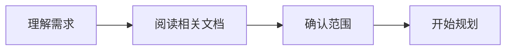

# 开发流程规范

> UniHub 的 OMO 编码闭环：Plan → Code → Verify → Review → Ship

---

## 1. 接到任务



- 阅读涉及模块的 `AGENTS.md`
- 阅读 `.omo/guidelines/` 中的相关规范
- **不确定即沟通**：任何不确定的设计方案、API 选择、代码细节，必须先和用户讨论，给出 2-3 个预备方案（含各自优劣），让用户决策
- 阅读相关源代码确认上下文（不要猜测代码行为）

---

## 2. 规划 (Plan)

### 简单变更（1-3 个文件）
- 直接在 `todowrite` 中列出步骤
- 标记 `in_progress` 后开始实现

### 复杂变更（新增插件/跨层修改/重构）
- 先在 `.omo/plans/` 下写 PRD 文件（参考 `planning.md` 模板）
- PRD 经确认后再创建 `todowrite` 拆分执行

### 通用原则
| 原则 | 说明 |
|------|------|
| 一个 todo 完成一个原子变更 | 不要在一个 todo 里混合 UI + 数据库 + 测试 |
| 一次只标记一个 `in_progress` | 串行执行，逐个完成 |
| 完成即标记 | 不批量完成 |

---

## 3. 实现 (Code)

### 分层依赖顺序

```
       core/   ← 基础设施优先（数据库/插件/路由/主题）
         ↓
     shared/   ← 共享 UI 组件
         ↓
    plugins/   ← 业务功能最后
```

### 文件修改规则
- **Bugfix**：最小修改，不重构任何不相关代码
- **新增功能**：遵循现有模式（DAO → Repository → Provider → UI）
- **不引入**：类型抑制（`as any`、`@ts-ignore`、`@ts-expect-error`）、文件级 `// ignore_for_file:`（改用行级 `// ignore:` + 原因注释）、空的 catch 块

### Import 约定

| 场景 | 规则 | 示例 |
|------|------|------|
| plugins → core 跨层引用 | 使用 `package:` 绝对路径，禁止 `../../../` 相对路径 | `package:uni_hub/src/core/...` ✅ / `../../../../core/...` ❌ |
| 同一层内引用 | 相对路径（简短即可） | `../data/thoughts_dao.dart` ✅ |
| `dart:` / `package:` 标准库 | 使用标准 import | 正常引入 |

### 资源清理

所有通过 Provider 获取的外部资源（数据库、Controller、监听器）都必须在 Provider 中注册 `ref.onDispose` 清理逻辑：

```dart
final myProvider = Provider<MyResource>((ref) {
  final resource = MyResource();
  ref.onDispose(() => resource.dispose());
  return resource;
});
```

沿用 `appDatabaseProvider` 的既有模式：

```dart
final appDatabaseProvider = Provider<AppDatabase>((ref) {
  final db = AppDatabase(_createExecutor());
  ref.onDispose(() => db.close());
  return db;
});
```

### 提取共享代码

当发现两个或多个文件中存在重复的 widget/函数/逻辑时，提取为共享组件。提取时注意：

- **命名冲突**：检查待删除的私有类名（如 `_ColorDot`、`_Cd` 表示同一事物）是否被其他文件引用
- **构造器**：共享 widget 的构造器参数使用命名参数，必传项用 `required`
- **文件位置**：属于插件层的共享代码放在 `lib/src/shared/` 或插件内的 `widgets/` 目录

### 测试同步
- 新增/修改数据层代码 → 同时加单元测试
- 新增 UI 组件 → 同时加 Widget 测试
- 测试文件和实现在同一个 commit（参考 `test/AGENTS.md`）

### 技能加载

> 委派子任务前必须先加载对应技能，否则子任务无法获得领域上下文。规则定义在 `.omo/skill-defaults.json`。

**流程**:
1. 委派前读取 `.omo/skill-defaults.json`，确定当前任务的 category 和具体类型
2. 合并 `categoryDefaults` + `taskOverrides` 得到 `load_skills` 列表
3. 在 `task(load_skills=[...])` 中传入合并结果
4. 视觉任务（`visual-engineering`）必须包含 `frontend-ui-ux`（强制造型检查）

```dart
// 示例：视觉任务 + 单元测试
task(
  category: "visual-engineering",
  load_skills: ["flutter-dev", "flutter-build-responsive-layout", "frontend-ui-ux", "dart-add-unit-test"],
  ...
);
```

---

## 4. 验证 (Verify)

每次实现步骤完成后（提交前），按顺序执行：

```bash
# 1. LSP 检查类型错误（在修改的文件上）
# 已内置于工具调用中

# 2. Dart 静态分析
flutter analyze

# 3. 如果有 warning 或 error：自动修复后重新 analyze
dart fix --dry-run    # 预览
dart fix --apply      # 确认后应用
flutter analyze       # 重新检查

# 4. 运行测试
flutter test

# 5. 最终确认：无可修复的 lint 残留
dart fix --dry-run    # 应输出"0 fixes"
```

### 验证通过标准
| 检查 | 必须通过 |
|------|----------|
| `lsp_diagnostics` | 无 error |
| `flutter analyze` | 0 error, 0 warning |
| `dart fix --dry-run` | 无可修复项（0 fixes） |
| `flutter test` | 所有测试通过 |
| 新增代码 | 禁止 `as any`, `@ts-ignore` |

### 验证失败处理
| 失败类型 | 处理方式 |
|----------|----------|
| LSP error | 修正类型错误，不绕行 |
| analyze warning | 执行 `dart fix` 步骤后重新 analyze |
| analyze error | 按错误信息修改 |
| `dart fix --dry-run` 有可修复项 | 执行 `dart fix --apply` 后重新 analyze |
| 测试失败 | 确认是代码问题还是测试问题 |

**连续 3 次修复无效 → 停止修改 → 咨询 Oracle。**

---

## 5. 审查 (Review)

### 触发条件
| 场景 | 操作 |
|------|------|
| 新增功能 | 触发 `/review-work`（含 sync-knowledge） |
| 重构 | 触发 `/review-work`（含 sync-knowledge） |
| Bugfix | 触发 `/review-work`（含 sync-knowledge，errors.md 静默写入） |
| 简单文档变更 | 不需要 |

### 知识同步 (sync-knowledge)

> `/review-work` 执行完成后自动触发知识同步，将本次改动的经验沉淀到文档中。映射规则定义在 `.omo/knowledge-map.json`。

**流程**:
1. 读取 `.omo/knowledge-map.json`，匹配改动文件路径
2. 根据匹配规则确定需更新的文档列表
3. 对每篇文档生成更新内容：
   - errors.md → 静默追加（无需确认）
   - AGENTS.md / guidelines → 展示 diff 预览，待用户确认后写入
4. 目标文档不存在时自动创建（填入基础模板）
5. 遇到未定义的改动模式 → 询问用户如何处理，并将新模式记入 knowledge-map.json

**内容生成规范**（模板引导，允许 agent 灵活组织）:

每类文档的生成粒度：
- **errors.md**：每个独立根因一条记录，每条包含场景/根因/修复/避免
- **AGENTS.md**：在文档末尾按时间倒序追加"近期变更"条目，包含改动文件、原因、影响、关键约定
- **guidelines**：在合适 section 下插入实际案例，包含背景、实现要点、注意事项

**格式参考**（以 learnings 为例，其余文档由 agent 根据文档结构和内容风格自主决定）:
```markdown
## YYYY-MM-DD: 简短标题

- **场景**: 做了什么遇到了这个错误
- **根因**: 为什么出错
- **修复**: 怎么解决的
- **避免**: 以后怎么防止
```

### 自检清单
- [ ] 没有类型抑制（`as any`, `@ts-ignore`）
- [ ] 没有死代码（无引用的类/函数）
- [ ] 没有空的 catch 块
- [ ] 新增代码遵循 `analysis_options.yaml` 规则
- [ ] 测试覆盖新增逻辑
- [ ] `flutter analyze` 通过
- [ ] 知识同步确认：本改动涉及的文档已更新；如遇未定义的改动模式，已补充知识图谱映射规则

### 知识同步故障处理

| 场景 | 处理方式 |
|------|----------|
| 生成内容被用户拒绝 | 标记为 skipped，不留脏提交，不修改文档 |
| 用户大幅修改了 agent 生成的模板内容 | 记录用户的修改模式到 knowledge-map.json（下次同类改动优先遵循） |
| 自动创建的 AGENTS.md 内容质量差 | `git checkout -- <file>` 回滚，修正后重新触发 sync-knowledge |
| knowledge-map.json 解析失败 | 检查 JSON 格式，修复后重试；紧急时可跳过 sync-knowledge 直接提交 |
| 目标文档已被手动编辑、sync-knowledge 追加导致冲突 | 展示冲突 diff，由用户决定保留/合并 |

---

## 6. 提交 (Ship)

### 提交原则
```
2+ 文件 → 拆分为多个原子提交（除非必须在同一个提交）
修复 + 测试 → 在同一个提交
```

### 提交信息格式
```
type: 中文描述

Ultraworked with [Sisyphus](https://github.com/code-yeongyu/oh-my-openagent)
Co-authored-by: Sisyphus <clio-agent@sisyphuslabs.ai>
```

| type | 场景 |
|------|------|
| `feat` | 新功能 |
| `fix` | Bug 修复 |
| `refactor` | 代码重构 |
| `docs` | 文档变更 |
| `chore` | 构建/配置/工具变更 |
| `test` | 测试新增/修改 |

### 推送
- 提交后不自动推送，等待用户指令
- 推送前确认 origin 跟踪状态

---

## 7. 错误记录与学习

> agent 在运行过程中遇到的错误必须被记录，避免以后重复犯错。

### 记录什么
| 类型 | 示例 | 记录方式 |
|------|------|----------|
| 编译/类型错误 | `The argument type 'X' can't be assigned` | 在 `.omo/learnings/errors.md` 中记录根因 + 修复方式 |
| 架构理解错误 | 用错了布局机制、走错了分层 | 记录正确的架构决策和当时的误解 |
| 工具使用错误 | LSP 不可用、测试框架理解偏差 | 记录排查步骤和最终结论 |
| 重复代码发现 | 发现了第 N 份 tag 解析副本 | 记录位置和避免方法 |

### 记录格式

```markdown
## [错误分类] 简短描述

- **发生时间**: YYYY-MM-DD
- **场景**: 做了什么遇到了这个错误
- **根因**: 为什么出错
- **修复**: 怎么解决的
- **避免**: 以后怎么防止
```

### 记录位置
- 单次运行的临时问题 → 由 sync-knowledge 自动记录到 `.omo/learnings/errors.md`
- 可以泛化的模式性问题 → 由 sync-knowledge 自动加入对应模块的 `AGENTS.md` 或 `.omo/guidelines/`

### 检查机制
- 每次 `/review-work` 的 sync-knowledge 阶段自动检查并追加新条目
- 修复已知问题前，先查阅该文件确认是否已有解决方案
- 如需查阅历史 learnings，直接查看 `.omo/learnings/errors.md`

---

## Loop 使用指南

### `/ulw-loop` — 有明确多步骤的实现任务
适合场景：
- "实现 X 功能的全部 CRUD"
- "将 X 从 A 重构为 B"
- 步骤明确的完整功能开发

### `/ralph-loop` — 需要探索的开放性问题
适合场景：
- "研究为什么 X 性能差"
- "改进首页布局"
- 需要迭代试错的探索性工作

### 手动模式 — 简单变更
适合场景：
- 修改 1-2 个文件
- 修复已知问题的单行改动
- 文档更新

### 知识同步在 Loop 中的行为

| Loop 类型 | sync-knowledge 触发时机 |
|-----------|------------------------|
| `/ulw-loop` | 仅在 Loop 完成时触发一次（不每次迭代触发） |
| `/ralph-loop` | 仅在 Loop 完成时触发一次（探索过程中的失败不记录） |
| 手动模式 | 用户决定是否触发 `/review-work` |

**规则**：
- Loop 中的中间迭代即使通过验证也不触发 sync-knowledge，避免频繁写入导致文档膨胀
- 只有 Loop 结束后（所有 todo 完成 + 最终验证通过）的统一 `/review-work` 才触发同步
- 迭代过程中如果发现可泛化的模式性问题，agent 应记录到临时上下文，最终一次写入

| 情况 | 操作 |
|------|------|
| LSP 不可用 | 检查是否安装了 Dart/Flutter SDK |
| `flutter analyze` 报错 | 先 `dart fix --apply`，再看剩余 error |
| 测试失败且原因不明确 | 阅读测试代码，确认测试期望什么 |
| 3 次尝试仍失败 | **停止修改，咨询 Oracle** |
| 回滚 | `git checkout -- <file>` 或 `git reset HEAD~1` |
