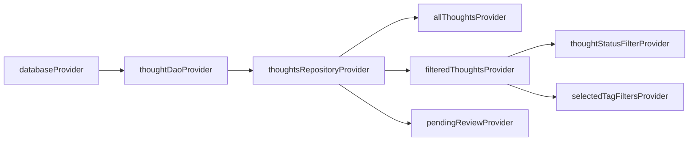

# State Management

> UniHub 状态管理模式 — 基于 Riverpod + Provider 体系

---

## Overview

状态管理以 Riverpod（`flutter_riverpod` + `riverpod_annotation`）为核心：

- **全局状态**：应用级 Provider（数据库、插件注册、搜索）
- **功能状态**：插件级 Provider（thoughts 列表、过滤、编辑）
- **UI 状态**：Widget 内部 `StatefulWidget` 状态

---

## Provider 类型速查

| Provider 类型 | 用途 | 示例 |
|---------------|------|------|
| `Provider<T>` | 服务/依赖注入 | `databaseProvider`, `pluginRegistryProvider` |
| `FutureProvider<T>` | 异步数据 | `thoughtProvider(id)`, `allThoughtsProvider` |
| `StateProvider<T>` | 简单可变状态 | `thoughtStatusFilterProvider`, `archiveFilterProvider` |
| `NotifierProvider<T>` | 复杂可变逻辑 | 标签过滤等需要组合 State 的场景 |
| `StreamProvider<T>` | 流式数据更新 | `(暂无使用)` |

---

## Provider 层级依赖



### 依赖注入方式

```dart
// 基础 Provider（注入依赖）
@riverpod
ThoughtsDao thoughtDao(ThoughtDaoRef ref) {
  final db = ref.watch(databaseProvider);
  return ThoughtsDao(db);
}

// 异步数据 Provider
@riverpod
Future<List<Thought>> allThoughts(AllThoughtsRef ref) {
  final repo = ref.watch(thoughtsRepositoryProvider);
  return repo.getAll();
}

// 简单过滤状态
@riverpod
class ThoughtStatusFilter extends _$ThoughtStatusFilter {
  @override
  ThoughtStatus build() => ThoughtStatus.all;
  
  void select(ThoughtStatus status) => state = status;
}
```

---

## 状态访问规则

### UI 层

```dart
// ConsumerWidget 中监听
class ThoughtList extends ConsumerWidget {
  Widget build(BuildContext context, WidgetRef ref) {
    final thoughtsAsync = ref.watch(filteredThoughtsProvider);
    return thoughtsAsync.when(
      data: (thoughts) => ListView(...),
      error: (err, stack) => ErrorWidget(...),
      loading: () => LoadingWidget(),
    );
  }
}
```

### 事件处理器中（一次性读取 + 写操作）

```dart
// 点击事件触发写操作
onPressed: () {
  ref.read(thoughtsRepositoryProvider).archive(id);
  ref.invalidate(allThoughtsProvider); // 刷新列表
}
```

---

## Provider 生命周期

- 基础 Provider（`Provider`/`FutureProvider`）不需要手动 dispose
- 插件注册 Provider 关联 `ref.onDispose` 清理
- `NotifierProvider` 在不再被监听时自动释放

---

## 状态提升原则

| 场景 | 策略 |
|------|------|
| 多个 Widget 共享数据 | 提升到公共父级或全局 Provider |
| Widget 内部临时 UI 状态 | `StatefulWidget` + `setState` |
| 跨页面共享的过滤/排序状态 | 全局 `StateProvider` / `NotifierProvider` |
| 服务器/数据库数据 | 用 `FutureProvider`，不缓存到本地 state |

---

## 常见错误

| 错误 | 正确做法 |
|------|---------|
| `ref.read(provider)` 在 build 中 | 用 `ref.watch` 替代 |
| `ref.watch` 非 Provider 的变量 | 用 `ref.listen` + 回调 |
| `provider.future` 后不再 `.when` | AsyncValue 必须三态处理 |
| 手动 `setState` 管理数据库数据 | 应通过 Provider 链驱动 rebuild |
